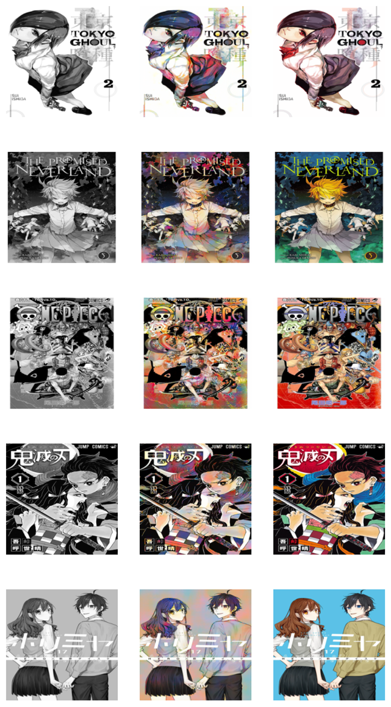

# Coloring manga

The goal of this project is to **realistically colorize manga pages**, which are very commonly only available in black and white. The colorizer should be specifically trained for coloring manga in an intuitive fashion, given that manga is typically more simple and stylized than real-life images. For this project, we train a conditional GAN based on the Pix2Pix model, which is described further in this [paper](https://arxiv.org/pdf/1611.07004).

Dataset: Manga109 dataset of colored manga covers. This dataset is notable because each of the authors of the 109 manga volumes used gave their express permission for usage in academia or research. 

Methodology: Instead of RGB, we use L\*a\*b space for each image in order to separate the greyscale component(L) from the colored components(a,b), where \*a represents green and red and \*b represents yellow and blue in a pixel. The GAN's generator will attempt to generate realistic a,b for a given L component, and the discriminator, given the same L, will attempt to deduce if the image is real or fake.

We use the trained model to get predictions on unseen data that has either been previously colorized or is only available in black and white. In particular, manga covers are often in color, while manga pages are in black and white. 

**Try it yourself:** Add some images to the test or bwtest folder and see how the model colorizes. Or try the image slider to see how the model's prediction looks versus the real colored image!

As an example, the following is a visualization of the black and white version, the model-colorized version, and the correct version.

